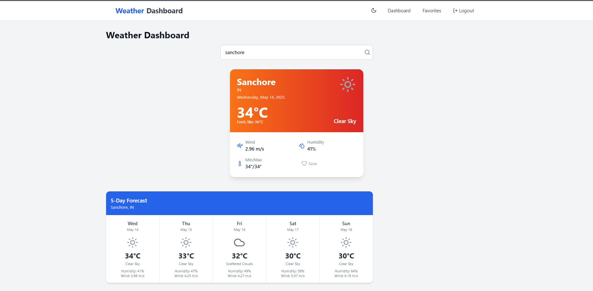

# Weather Dashboard

A beautiful and fully-featured weather dashboard application built with React, TypeScript, and Tailwind CSS. Get real-time weather data, save your favorite locations, and enjoy a seamless dark mode experience.


## Features

- 🌤️ Real-time weather data from OpenWeatherMap API
- 🔐 User authentication with email/password
- ❤️ Save and manage favorite locations
- 🌙 Dark mode support
- 📱 Fully responsive design
- 🎯 5-day weather forecast
- 🔍 Search for any city worldwide

## Tech Stack

- React 18
- TypeScript
- Tailwind CSS
- Vite
- Lucide React Icons
- React Router DOM

## Getting Started

### Prerequisites

- Node.js (v18 or higher)
- npm or yarn
- OpenWeatherMap API key

### Installation

1. Clone the repository:
```bash
git clone https://github.com/yourusername/weather-dashboard.git
cd weather-dashboard
```

2. Install dependencies:
```bash
npm install
```

3. Create a `.env` file in the root directory and add your OpenWeatherMap API key:
```env
VITE_OPENWEATHERMAP_API_KEY=your_api_key_here
```

4. Start the development server:
```bash
npm run dev
```

The app will be available at `http://localhost:5173`

### Building for Production

To create a production build:

```bash
npm run build
```

The built files will be in the `dist` directory.

## Project Structure

```
src/
├── components/         # Reusable components
│   ├── auth/          # Authentication components
│   ├── layout/        # Layout components
│   └── weather/       # Weather-related components
├── context/           # React context providers
├── pages/             # Page components
├── types/             # TypeScript type definitions
└── main.tsx          # Application entry point
```

## Features in Detail

### Weather Data
- Current weather conditions
- Temperature (Celsius)
- Humidity and wind speed
- Weather description and icons
- 5-day forecast

### User Features
- User registration and login
- Save favorite locations
- Quick access to saved locations
- Persistent dark mode preference

### UI/UX

- Clean and modern design
- Responsive layout for all devices
- Smooth transitions and animations
- Intuitive navigation
- Loading states and error handling

## Contributing

Contributions are welcome! Please feel free to submit a Pull Request.

## License

This project is licensed under the MIT License - see the [LICENSE](LICENSE) file for details.

## Acknowledgments

- Weather data provided by [OpenWeatherMap](https://openweathermap.org/)
- Icons by [Lucide](https://lucide.dev/)